# LynxGPT — Complete Architecture Deep-Dive

LynxGPT is an **AI-powered academic assistant** built for NIT Trichy students. It uses a **LangGraph agent** with an intelligent router to handle question papers, circulars/course plans, resume-to-job matching, subject Q&A, and conversational memory — all wrapped in a chat-based UI.

---

## High-Level System Architecture

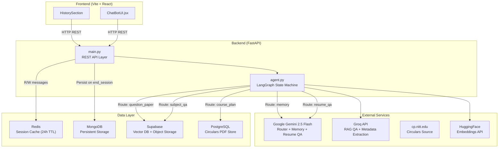

---

## The LangGraph Agent — The Brain

The core intelligence lives in [agent.py](file:///e:/lynx_gpt_main_2/final_lynx/LynxGPT/backend/agent.py). It's a **finite state machine** built with LangGraph.

### State Definition

```python
class State(TypedDict):
    messages: List[BaseMessage]       # Full conversation history
    current_input: str                # Latest user query
    route: Literal[...]               # Chosen route label
    last_result: Optional[Any]        # Structured result (e.g. links)
    resume_context: Optional[Dict]    # Parsed resume data from Dreamer
```

### Router Flow

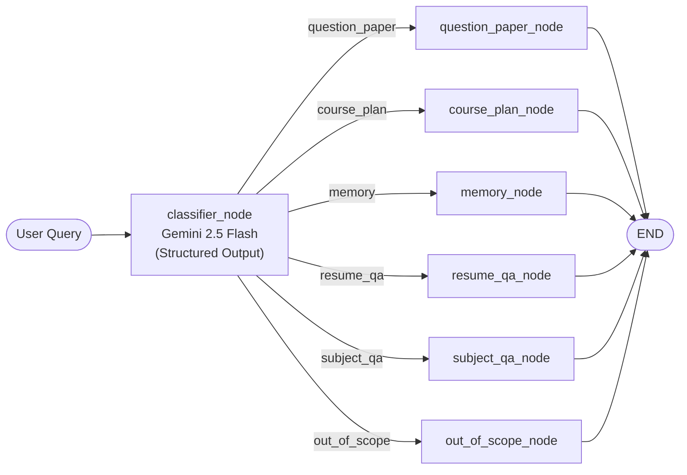

### How Routing Works

1. **Gemini with structured output** — The LLM is constrained to output a `Route` Pydantic model with exactly 1 of 6 labels
2. **Follow-up detection** — Before calling the LLM, it checks if the last bot message contained "please specify" → auto-routes back to `question_paper`
3. **The route label** is stored in `state["route"]`, and `route_decider()` returns it to LangGraph's conditional edge system

### The `invoker()` Function

This is the **single entry point** called by `main.py`:

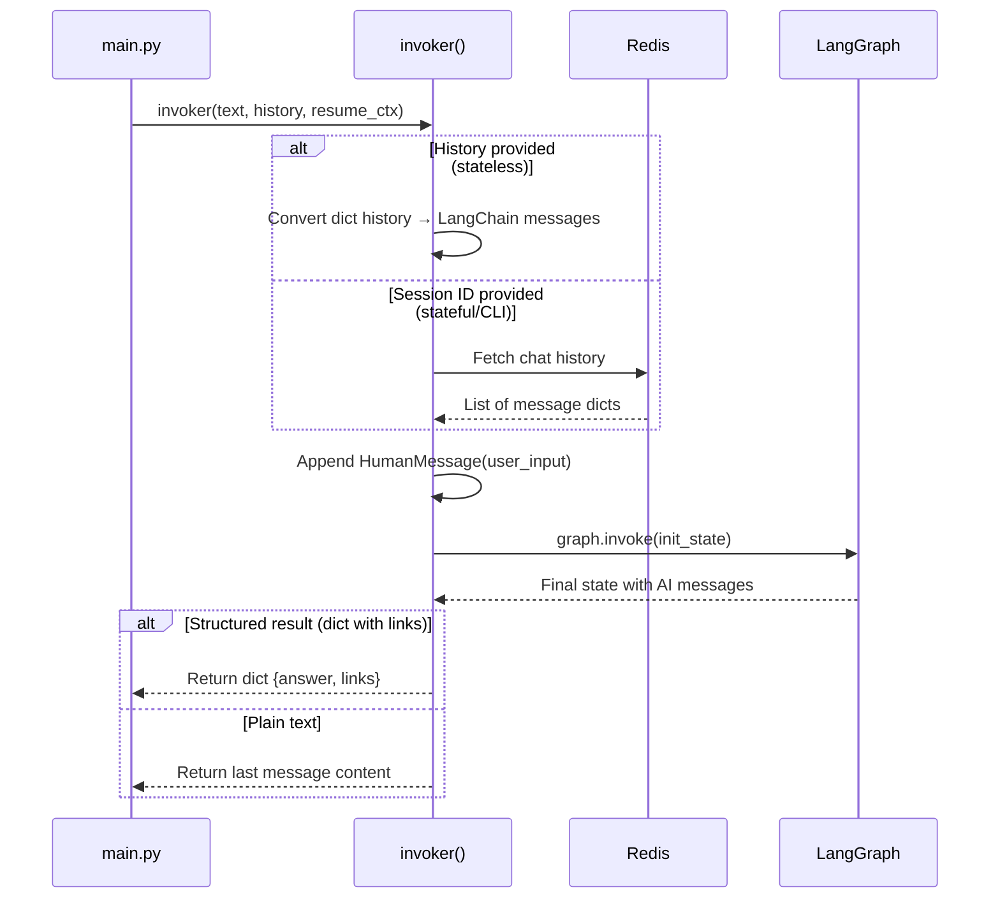

---

## The FastAPI Layer — `main.py`

[main.py](file:///e:/lynx_gpt_main_2/final_lynx/LynxGPT/backend/main.py) is the REST API that the frontend talks to.

### API Endpoints

| Endpoint | Method | Purpose |
|---|---|---|
| `/health` | GET | Docker healthcheck |
| `/conversations` | GET | List all conversations |
| `/conversations` | POST | Create new conversation |
| `/conversations/{id}` | PATCH | Rename conversation |
| `/conversations/{id}` | DELETE | Delete conversation |
| `/conversations/{id}/star` | PATCH | Toggle star/favorite |
| `/conversations/{id}/messages` | GET | Get messages (Redis → Mongo fallback) |
| `/conversations/{id}/messages` | POST | **Send a message** (triggers agent) |
| `/conversations/{id}/end` | POST | Flush Redis → MongoDB |
| `/conversations/{id}/upload_pdf/{type}` | POST | Upload PDF (Resume or QP) |
| `/conversations/purge-empty` | POST | Clean up empty conversations |

### Message Flow (the critical path)

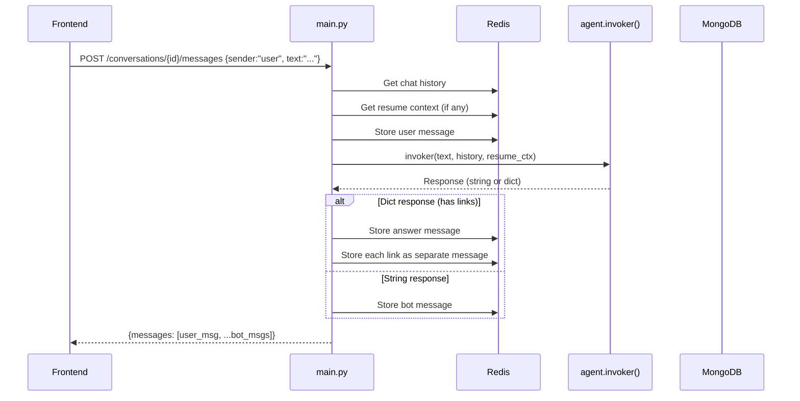

### PDF Upload Flow

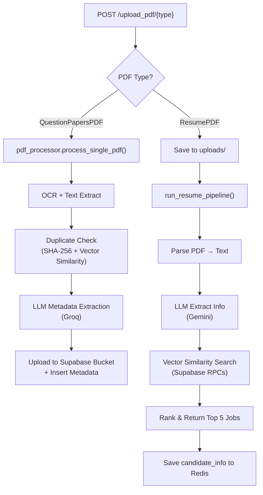

---

## Module Deep-Dives

### 1. QuestionPapers Module

Located in [QuestionPapers/](file:///e:/lynx_gpt_main_2/final_lynx/LynxGPT/backend/QuestionPapers).

**Two files, two roles:**

| File | Role |
|---|---|
| [pdf_processor.py](file:///e:/lynx_gpt_main_2/final_lynx/LynxGPT/backend/QuestionPapers/pdf_processor.py) | **Ingestion** — Process uploaded PDFs |
| [query_processor.py](file:///e:/lynx_gpt_main_2/final_lynx/LynxGPT/backend/QuestionPapers/query_processor.py) | **Retrieval** — Search for question papers by query |

**Ingestion Pipeline (`pdf_processor.py`):**
1. OCR text extraction (PyMuPDF + Tesseract)
2. **First duplicate check** → SHA-256 hash against Supabase
3. **Second duplicate check** → Vector similarity of embeddings (HuggingFace API)
4. **Metadata extraction** → Groq LLM extracts: department, subject, year, exam type
5. Upload PDF bytes to Supabase Storage bucket
6. Insert metadata + embedding into Supabase DB

**Query Pipeline (`query_processor.py`):**
1. Groq LLM extracts metadata from natural language query
2. Build Supabase query with strict AND matching
3. If no results → fallback to fuzzy OR matching on subject words
4. Return `{answer: "...", links: [...pdf_urls]}`

---

### 2. Circulars Module

Located in [Circulars/](file:///e:/lynx_gpt_main_2/final_lynx/LynxGPT/backend/Circulars). Handles **course plans, syllabus, and circulars from NIT Trichy**.

| File | Role |
|---|---|
| [scraper.py](file:///e:/lynx_gpt_main_2/final_lynx/LynxGPT/backend/Circulars/scraper.py) | Crawls `cp.nitt.edu` and downloads PDFs to PostgreSQL |
| [append_data.py](file:///e:/lynx_gpt_main_2/final_lynx/LynxGPT/backend/Circulars/append_data.py) | OCRs PDFs, extracts course metadata via Groq, chunks text, and embeds into PostgreSQL (pgvector) |
| [retriever.py](file:///e:/lynx_gpt_main_2/final_lynx/LynxGPT/backend/Circulars/retriever.py) | RAG retrieval chain — semantic search + Gemini LLM answer generation |

**Data Pipeline:**

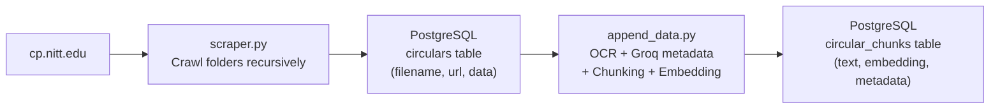

**Retrieval Path:**
1. LLM extracts `course_code` and `course_name` from the user query
2. Semantic vector search on `circular_chunks` using `pgvector`
3. If results found → passes chunks to a Gemini RAG chain for answer generation
4. Returns `{answer: "...", links: [...pdf_urls]}`

---

### 3. Dreamer Module (Resume → Job Matching)

Located in [Dreamer/dreamer/](file:///e:/lynx_gpt_main_2/final_lynx/LynxGPT/backend/Dreamer/dreamer). This is the most complex module.

**Architecture:**

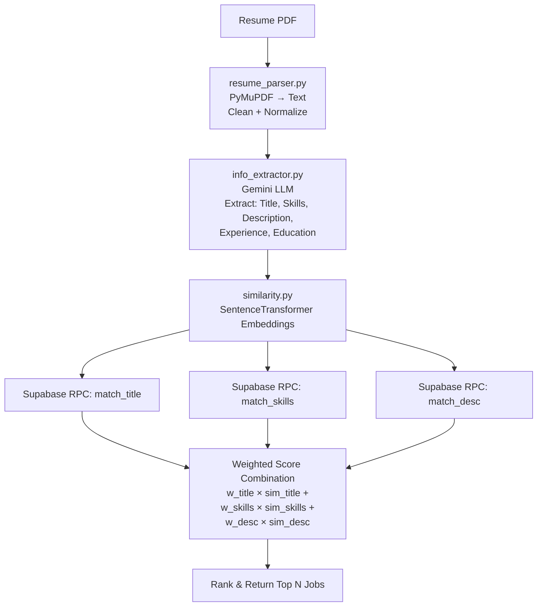

**Key files:**

| File | Purpose |
|---|---|
| [pipeline.py](file:///e:/lynx_gpt_main_2/final_lynx/LynxGPT/backend/Dreamer/dreamer/pipeline.py) | Orchestrator — calls parse → extract → match |
| [resume_parser.py](file:///e:/lynx_gpt_main_2/final_lynx/LynxGPT/backend/Dreamer/dreamer/resume_parser.py) | PDF → cleaned text via PyMuPDF |
| [info_extractor.py](file:///e:/lynx_gpt_main_2/final_lynx/LynxGPT/backend/Dreamer/dreamer/info_extractor.py) | Gemini LLM → structured JSON (Title, Skills, Description, Experience, Education) |
| [similarity.py](file:///e:/lynx_gpt_main_2/final_lynx/LynxGPT/backend/Dreamer/dreamer/similarity.py) | SentenceTransformer embeddings → 3 Supabase RPCs → weighted scoring |
| [database.py](file:///e:/lynx_gpt_main_2/final_lynx/LynxGPT/backend/Dreamer/dreamer/database.py) | Supabase CRUD for jobs table + candidate criteria filtering |
| [Scrape.py](file:///e:/lynx_gpt_main_2/final_lynx/LynxGPT/backend/Dreamer/dreamer/Scrape.py) | Async job scraper → embeds jobs → upserts to Supabase |
| [app.py](file:///e:/lynx_gpt_main_2/final_lynx/LynxGPT/backend/Dreamer/dreamer/app.py) | Standalone FastAPI app (also used as importable module) |

---

### 4. RAG / Subject QA Module

Located in [RAG/rag_engine.py](file:///e:/lynx_gpt_main_2/final_lynx/LynxGPT/backend/RAG/rag_engine.py). Handles **subject-specific academic questions** using hybrid search.

**How Hybrid Search Works:**

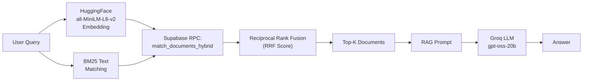

Key design: `CustomSupabaseVectorStore` overrides LangChain's default to pass **both** the query embedding AND raw query text to the Supabase RPC function, enabling hybrid BM25 + semantic search with RRF score fusion.

---

### 5. Redis Session Layer

[redis_client.py](file:///e:/lynx_gpt_main_2/final_lynx/LynxGPT/backend/database/redis_client.py) manages **ephemeral session state** with a graceful fallback.

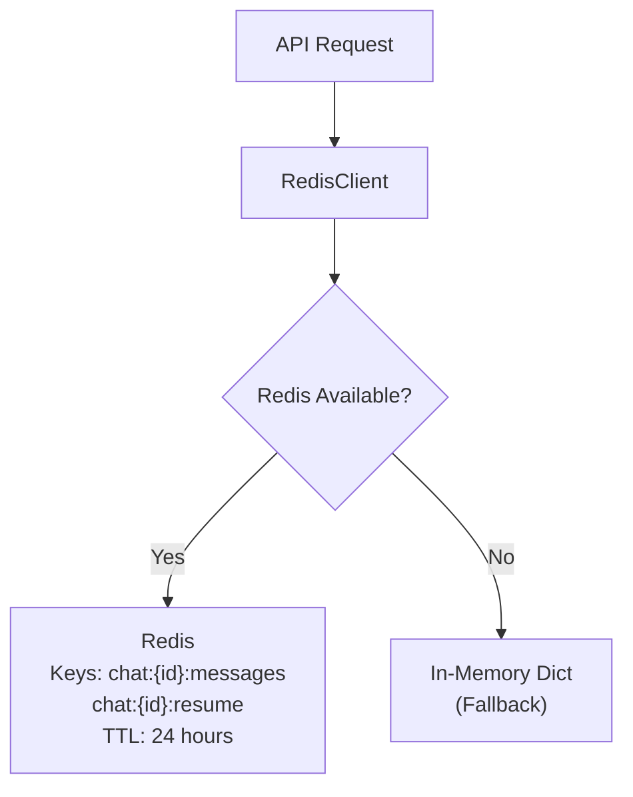

**Methods:**
- `get_chat_history(conv_id)` → List of message dicts
- `add_message(conv_id, msg)` → Append + set 24h TTL
- `save_resume_context(conv_id, ctx)` → Save parsed resume
- `get_resume_context(conv_id)` → Retrieve parsed resume
- `clear_conversation(conv_id)` → Delete all session data

---

## Frontend Architecture

A **React + Vite** SPA with a dark, glassmorphic design.

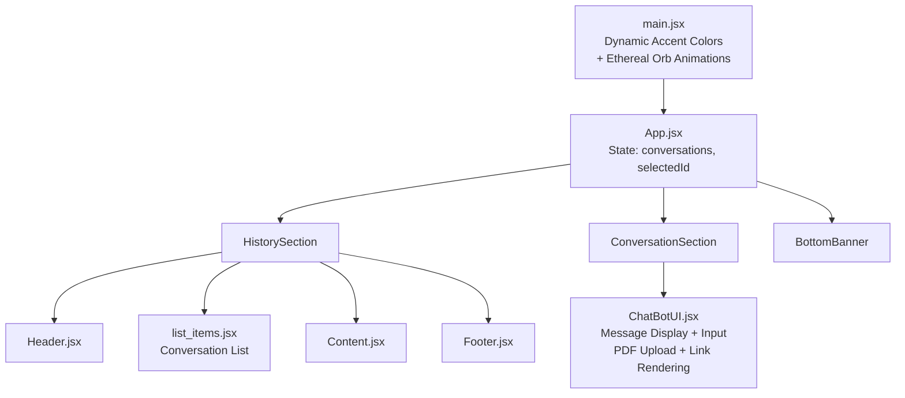

**Notable design decisions:**
- **Dynamic theming** — On every page load, a random accent color is picked from 7 options (deep-violet, hot-pink, sky-blue, etc.)
- **Ethereal orbs** — 7 animated gradient blobs at strategic positions for ambient lighting
- **Conversation persistence** — `selectedId` saved to `localStorage`
- **Limits enforced** — Max 64 normal + 32 starred conversations

---

## Docker / Infrastructure

The [docker-compose.yaml](file:///e:/lynx_gpt_main_2/final_lynx/LynxGPT/docker-compose.yaml) orchestrates 4 services:

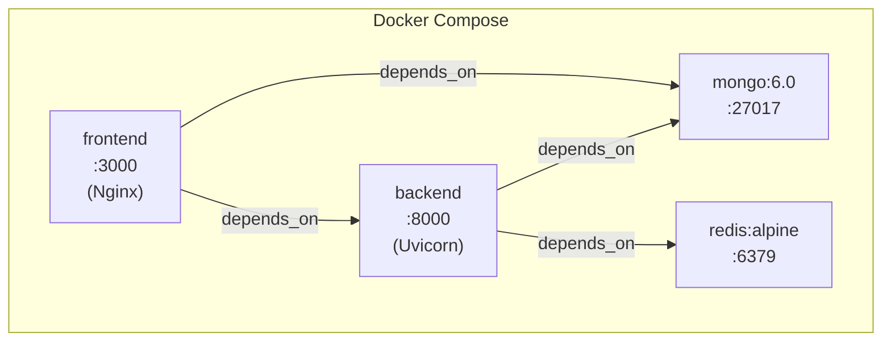

All services have **healthchecks** and **restart policies** (`unless-stopped`). Volumes persist MongoDB data and Redis snapshots.

---

## Data Flow — Complete Request Lifecycle

Here's what happens when a user types **"Show me CSE question papers from 2023"**:

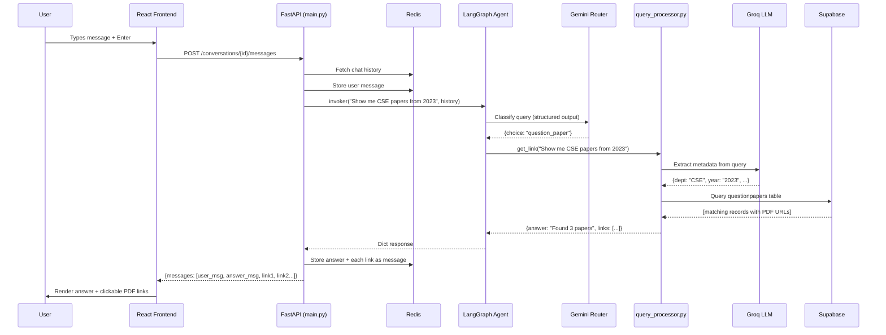

---

## External Dependencies Summary

| Service | Used For | Used By |
|---|---|---|
| **Google Gemini 2.5 Flash** | Query routing, Memory/Chat, Resume QA, Circulars retrieval | `agent.py`, `retriever.py`, `resume_parser.py`, `info_extractor.py` |
| **Groq API** | Subject QA (RAG), Metadata extraction from PDFs/queries | `rag_engine.py`, `query_processor.py`, `pdf_processor.py`, `append_data.py` |
| **Supabase** | Vector storage, Question paper storage, Job listings DB | `rag_engine.py`, `pdf_processor.py`, `query_processor.py`, `similarity.py` |
| **PostgreSQL** | Circulars PDF + chunk storage with pgvector | `scraper.py`, `append_data.py`, `retriever.py` |
| **HuggingFace** | Embeddings (all-MiniLM-L6-v2, SentenceTransformer) | `rag_engine.py`, `retriever.py`, `append_data.py`, `pdf_processor.py` |
| **MongoDB** | Conversation persistence | `main.py` |
| **Redis** | Session cache (24h TTL) | `main.py`, `agent.py` |
